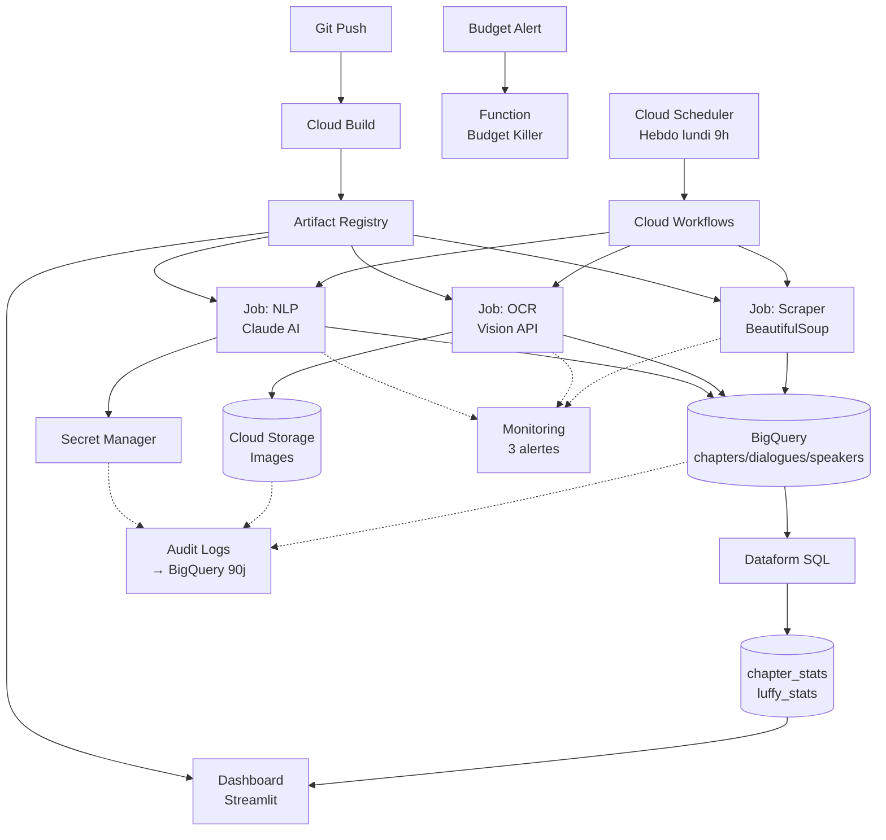

# One Piece Data Pipeline

Pipeline de données serverless automatisé sur Google Cloud Platform : scraping web (1172 chapitres One Piece), OCR Google Vision (20 941 pages), analyse NLP Claude AI (289 mentions), orchestration Cloud Workflows, transformations Dataform, dashboard Streamlit. Infrastructure as Code complète avec Terraform, CI/CD Cloud Build, monitoring avancé et sécurité IAM au moindre privilège.

## Architecture



## Chiffres clés

| Métrique | Valeur |
|----------|--------|
| **Chapitres scrapés** | 1 172 |
| **Pages OCR extraites** | 20 941 |
| **Mentions analysées** (NLP) | 289 |
| **Service accounts IAM** | 9 (moindre privilège) |
| **Coût mensuel** | 10-40 € (serverless) |

## Choix d'ingénierie

- **Idempotence** : Ingestion incrémentale (requête `MAX(chapter_number)` avant scraping), filtrage des pages déjà traitées, statut `success_empty` pour arrêt propre sans doublons
- **Résilience** : Retry avec backoff exponentiel (5s → 10s → 20s), dead-letter table `failed_pages` pour erreurs item-level sans bloquer le pipeline
- **Performance BigQuery** : Table `dialogues` partitionnée (DAY sur `processed_at`) + clusterisée (`chapter_number`) → économie ~90% de scan sur requêtes filtrées
- **Qualité des données** : Assertions Dataform (`uniqueKey`, `nonNull`) sur tables analytiques, échec automatique si doublons ou valeurs nulles
- **Sécurité IAM** : 9 service accounts scopés (BigQuery scopé au dataset, Secret Manager scopé au secret, aucun `roles/owner` ou `roles/editor`), rôle IAM custom créé
- **Observabilité** : Audit Logs → BigQuery (rétention 90j RGPD), 3 alertes Cloud Monitoring (job failures, dashboard downtime, IAM escalation), 3 log-based metrics, 2 dashboards
- **Protection coûts** : Budget Killer (Cloud Function détache le billing à 100% du budget), lifecycle rules GCS (Nearline 30j → Coldline 90j, -60% coût stockage)
- **CI/CD** : Build parallèle de 3 images Docker, tagging par commit Git (`${SHORT_SHA}`), déploiement automatique Terraform sur push `main`

<details>
<summary><strong>📊 Stack technique complète</strong></summary>

| Catégorie | Technologies |
|-----------|-------------|
| **Cloud** | Google Cloud Platform |
| **Compute** | Cloud Run (Jobs + Service), Cloud Functions Gen2 |
| **Orchestration** | Cloud Workflows, Cloud Scheduler |
| **Data** | BigQuery, Dataform, Cloud Storage |
| **AI/ML** | Claude AI (Anthropic), Google Cloud Vision API |
| **IaC** | Terraform 1.6 (backend GCS) |
| **CI/CD** | Cloud Build, Artifact Registry |
| **Security** | Secret Manager, Audit Logs, IAM deny policies |
| **Monitoring** | Cloud Monitoring, Cloud Logging |
| **Dashboard** | Streamlit, Plotly |
| **Code** | Python 3.11, SQL, YAML, HCL |

</details>

<details>
<summary><strong>🔐 9 Service Accounts IAM (principe du moindre privilège)</strong></summary>

| Service Account | Rôles | Scope |
|----------------|-------|-------|
| `sa-scheduler` | `workflows.invoker` | Projet |
| `sa-workflow` | `run.invoker`, `run.viewer`, `storage.objectViewer` | Projet + bucket scopé |
| `sa-job-scraper` | `bigquery.dataEditor`, `bigquery.jobUser`, `storage.objectAdmin` | **Dataset onepiece** + bucket scopé |
| `sa-job-ocr` | `bigquery.dataEditor`, `bigquery.jobUser`, `storage.objectAdmin` | **Dataset onepiece** + bucket scopé |
| `sa-job-nlp` | `bigquery.dataEditor`, `bigquery.jobUser`, `secretmanager.secretAccessor` | **Dataset onepiece** + **secret anthropic-api-key uniquement** |
| `sa-dashboard` | `bigquery.dataViewer`, `bigquery.jobUser` | Lecture seule |
| `sa-dataform` | `bigquery.dataEditor`, `bigquery.jobUser` | Datasets onepiece + dataform_assertions |
| `sa-budget-killer` | `billing.projectManager` | Projet |
| `sa-cloudbuild` | 13 rôles (artifactregistry, run, workflows...) | Projet (déploiement IaC) |

✅ Aucun service account avec `roles/owner` ou `roles/editor`
✅ IAM BigQuery scopé au dataset (pas tous les datasets)
✅ IAM Secret Manager scopé au secret (NLP accède uniquement à Anthropic, pas Gemini)
✅ Rôle IAM custom `secretmanager_metadata_manager` créé

</details>

<details>
<summary><strong>🔄 Fonctionnement du pipeline</strong></summary>

### 1. Cloud Scheduler → Cloud Workflows
Déclenchement hebdomadaire (lundi 9h) via API REST OAuth2

### 2. Workflow : Orchestration séquentielle
- **Scraper** : Lance job → poll statut 30s → lit `_status/scraper-status.json` → valide (`success`/`error`/`success_empty`)
- **OCR** : Si nouveaux chapitres → lance job → poll → validation
- **NLP** : Si nouvelles pages OCR → lance job → poll → validation

### 3. Scraper (BeautifulSoup)
```
1. Requête BigQuery : MAX(chapter_number) → dernier chapitre traité
2. Scrape onepiecescan.fr → liste tous chapitres disponibles
3. Filtre : nouveaux chapitres uniquement (ingestion incrémentale)
4. Écrit BigQuery : table chapters
5. Écrit GCS : _status/scraper-status.json
```

### 4. OCR (Google Cloud Vision API)
```
1. Requête BigQuery : chapitres déjà traités
2. Pour chaque nouvelle page :
   - Télécharge image
   - Upload GCS : chapitre-X/page-YYY.jpg
   - Vision API (avec retry backoff 5s/10s/20s)
   - Écrit BigQuery : table dialogues (partitionnée DAY + clusterisée)
3. Erreurs → table failed_pages (dead-letter)
```

### 5. NLP (Claude AI Haiku)
```
1. Requête BigQuery : pages contenant "roi des pirates"
2. Pour chaque page non analysée :
   - Prompt Claude (40 lignes) : contexte One Piece, classification
   - Parse JSON : speaker, phrase, luffy_says_it, about_luffy
   - Écrit BigQuery : table speakers
3. Erreurs → table failed_pages
```

### 6. Dataform : Transformations SQL
- **chapter_stats** : Statistiques par chapitre, arcs narratifs, rolling mean 50 chapitres, top 10 longest
- **luffy_stats** : Agrégations mentions Luffy (par lui-même vs. sur lui)
- **Assertions** : `uniqueKey`, `nonNull` → échec si doublons

### 7. Dashboard Streamlit
Cloud Run Service (autoscaling 0-10), visualisations Plotly, accès IAM restreint

</details>

<details>
<summary><strong>📁 Structure du repo</strong></summary>

```
onepiece-pipeline/
├── terraform/               # Infrastructure as Code
│   ├── main.tf             # BigQuery, GCS, Cloud Run, secrets
│   ├── service_accounts.tf # 9 service accounts + IAM
│   ├── workflows.tf        # Cloud Workflows orchestration
│   ├── dataform.tf         # Dataform repository
│   ├── audit.tf            # Audit logs → BigQuery
│   ├── monitoring.tf       # Alertes + dashboards
│   ├── budget.tf           # Budget + Cloud Function killer
│   ├── cloudbuild.tf       # Trigger CI/CD
│   └── backend.tf          # State backend GCS
│
├── scraper/                # Code Python
│   ├── scraper.py          # BeautifulSoup scraping
│   ├── ocr_pipeline.py     # Google Vision API
│   ├── nlp_pipeline.py     # Claude AI (Anthropic)
│   ├── dashboard.py        # Streamlit + Plotly
│   ├── utils.py            # Retry backoff exponentiel
│   ├── workflow.yaml       # Définition Cloud Workflows
│   ├── Dockerfile          # Image scraper + OCR
│   ├── Dockerfile.dashboard
│   └── Dockerfile.nlp
│
├── dataform/               # Transformations SQL
│   ├── definitions/
│   │   ├── chapter_stats.sqlx
│   │   ├── luffy_stats.sqlx
│   │   └── sources/
│   └── dataform.json
│
├── functions/
│   └── kill-billing/       # Budget Killer (détache billing à 100%)
│       ├── main.py
│       └── requirements.txt
│
├── queries/
│   └── echecs_par_semaine.sql  # Analyse logs erreurs
│
└── cloudbuild.yaml         # CI/CD : build + deploy auto
```

</details>

<details>
<summary><strong>🚀 Déploiement</strong></summary>

### Prérequis
- GCP project + Billing Account
- `gcloud`, `terraform` >= 1.6

### 1. Configuration Terraform
```bash
cd terraform
cp terraform.tfvars.example terraform.tfvars
# Éditer : project_id, region, billing_account_id
```

### 2. Créer les secrets API
```bash
echo -n "sk-ant-..." | gcloud secrets create anthropic-api-key --data-file=-
echo -n "AIza..." | gcloud secrets create gemini-api-key --data-file=-
```

### 3. Déployer l'infrastructure
```bash
# Créer le bucket Terraform state (1ère fois uniquement)
gsutil mb -l europe-west1 gs://<PROJECT_ID>-tfstate

terraform init
terraform plan -var="image_tag=latest"
terraform apply -var="image_tag=latest"
```

### 4. Build et push des images
Le CI/CD Cloud Build se déclenche automatiquement sur push `main`.

Pour build manuel :
```bash
docker build -f scraper/Dockerfile -t europe-west1-docker.pkg.dev/<PROJECT_ID>/onepiece-repo/scraper:latest scraper/
docker push europe-west1-docker.pkg.dev/<PROJECT_ID>/onepiece-repo/scraper:latest
# Idem pour dashboard et nlp-pipeline
```

### 5. Test manuel du pipeline
```bash
gcloud workflows run onepiece-workflow --location=europe-west1
```

</details>

---

**Auteur** : [DilaraGlr](https://github.com/DilaraGlr)
